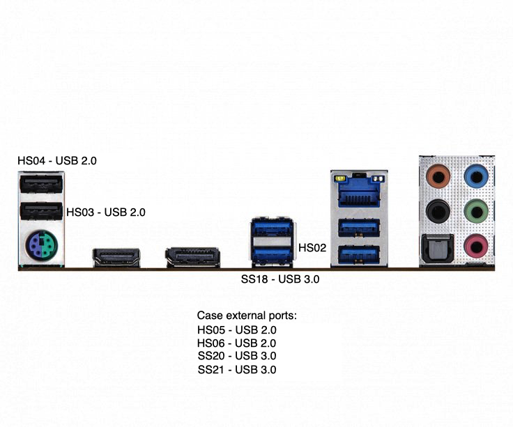

# Hackintosh for i5-11600K Guide

## Info

This is the fully detailed guide on how to create a working Hackintosh machine using:

* OpenCore 0.7.3
* processor: Intel i5-11600K (11-gen), socket 1200
* motherboard: [ASRock B560M Steel Legend](https://www.asrock.com/MB/Intel/B560M%20Steel%20Legend/index.pl.asp#Specification)
  * LAN: 2.5Gbit Dragon RTL8125BG
  * audio: Realtek ALC897
* RAM: G.Skill Aegis 4x16GB (3200MHz)
* GFX: nVidia Quadro K420 (1GB DDR3)
* SSD: Kioxia 512 GB NVMe SSD, Crucial 1TB SATA SSD

All working great, beside the fact that there is *NO*:

* Bluetooth receiver
* WiFi card
* camera

installed in the system. Also any compatible graphic card had to be used due to the fact that 11th-gen iGPU is not yet supported by macOS itself.


## Disclaimer

Most of the steps, instructions, information etc. has been taken from following sources:

* [Dortania](https://dortania.github.io/OpenCore-Install-Guide) - general OpenCore configuration, tooling info, SSDTs extraction, USB port mapping
* [Hackintosh i5-11400K on Big Sur 11.2.3](https://www.youtube.com/watch?v=O2uDuXSBudI); with [shared settings for ASRock Steel Legend](https://mybox.naver.com/share/list?shareKey=QuiWYI_wB1GVEsBrB8aNjJoG0PHF_coirdt7tLsck2qqHpqF6mCcykf5iiAaTJp7W6RxJH-PRcpsdT1QDE_sTAU%3D) - taken semi-working config
* [Hackintosh i5-11600K video](https://www.youtube.com/watch?v=kc5OnPa_jIE) - another tutorial explaining a lot of stuff and inspiring more ideas
* [EASY USB Port Mapping on Intel 2020](https://www.youtube.com/watch?v=uww6Cizil_g) - USB port-mapping inspiration; however nothing mentioned here worked straight

## Tools

List of needed tools:

1. [ProperTree](https://github.com/corpnewt/ProperTree) - .plist editor
1. [MountEFI](https://github.com/corpnewt/MountEFI) - to mount hidden boot partition (on both installer USB-stick & destination machine)
1. [SSDTTime](https://github.com/corpnewt/SSDTTime) - generator of ACPI tables on destination hardware
1. [USBMap](https://github.com/corpnewt/USBMap) - generator of dedicated USB port mapping kernel extension
1. [HackingTool by Headkaze](https://github.com/headkaze/Hackintool) - to verify settings on running macOS are fine; wasn't always working fine if `EFI` configuration had error on target machine

## BIOS Setup

Following features have to be properly enabled or disabled to make the macOS bootable:

* enable XMP on memory modules to achieve 3200MHz frequency
* `Advanced > CPU Configuration`:
  * Above 4G Decoding - `Enabled` (as Disabled by default)
  * VT-d - `Disabled` (as Enabled by default)
  * iGPU Multi-Monitor - `Disabled` (as Enabled by default)
  * CFG Lock - `Disabled` (as Enabled by default)
* `Advanced > Storage Configuration`:
  * SATA Mode Selection - set to `AHCI`
  * SATA Aggressive Link Power Management - `Disabled`
* `Advanced > USB Configuration`:
  * Legacy USB Support - `Enabled`
  * XHCI Hand-off - `Enabled` (as Disabled by default)
* `Boot`:
  * Fast Boot - `Disabled` (as Enabled by default)
  * Secure Boot - `Disabled`
* `Boot > CSM (Compatibility Support Mode)`:
  * CSM - Disabled (as Enabled by default)

Official info could be found [here](https://dortania.github.io/OpenCore-Install-Guide/config.plist/comet-lake.html#intel-bios-settings).

## Booting problems

## Kernel Extensions (kext)

## Changing CPU ID

## ACPI

Best way to get proper ACPI files (aka .aml) is tu use [SSDTTime](https://github.com/corpnewt/SSDTTime) directly on the target machine.

Steps to create desired files (in particular for the platform: `SSDT-AWAC.aml`, `SSDT-EC.aml`, `SSDT-PLUG.aml`) present as following:

1. Create bootable Ubuntu USB
    * start a Windows machine
    * plug-in 16GB+ USB-stick
    * download [Rufus](https://rufus.ie/)
    * download [Ubuntu Desktop ISO](https://ubuntu.com/download)
    * run Rufus, select USB-stick, select `FreeDOS` boot-selection and point to Ubuntu ISO as described [here](https://ubuntu.com/tutorials/create-a-usb-stick-on-windows#4-boot-selection-and-partition-scheme)
1. Upload [SSDTTime](https://github.com/corpnewt/SSDTTime) tool onto the USB-stick too as it will be required later, full info is described [here](https://dortania.github.io/Getting-Started-With-ACPI/ssdt-methods/ssdt-easy.html#running-ssdttime)

## Audio

Supported list of codecs can be found [here](https://github.com/acidanthera/AppleALC/wiki/Supported-codecs). However I haven't had to do anything special to make the audio work out-of-the-box once HDMI was plugged-in and connected with monitor containing speakers.

## USB mapping

At the end of the process the USBMap tool known following info about the ports (which is far less than 15 ports and all USB 2.0 & USB 3.0 work flawlessly):

```plain
#######################################################
#                Discover USB Ports                   #
#######################################################
    ----- XHCI@14 Controller -----
 1. HS02 | AppleUSB20XHCIPort |  2 (02000000) | 14100000 | Type 0
    HS02
    - ASM107x
 2. HS03 | AppleUSB20XHCIPort |  3 (03000000) | 14200000 | Type 0
    HS03
 3. HS04 | AppleUSB20XHCIPort |  4 (04000000) | 14300000 | Type 0
    HS04
 4. HS05 | AppleUSB20XHCIPort |  5 (05000000) | 14400000 | Type 0
    HS05
 5. HS06 | AppleUSB20XHCIPort |  6 (06000000) | 14500000 | Type 0
    HS06
 6. SS02 | AppleUSB30XHCIPort | 18 (12000000) | 14600000 | Type 3
    SS18
    - ASM107x
 7. SS04 | AppleUSB30XHCIPort | 20 (14000000) | 14700000 | Type 3
    SS20
 8. SS05 | AppleUSB30XHCIPort | 21 (15000000) | 14800000 | Type 3
    SS21
```


