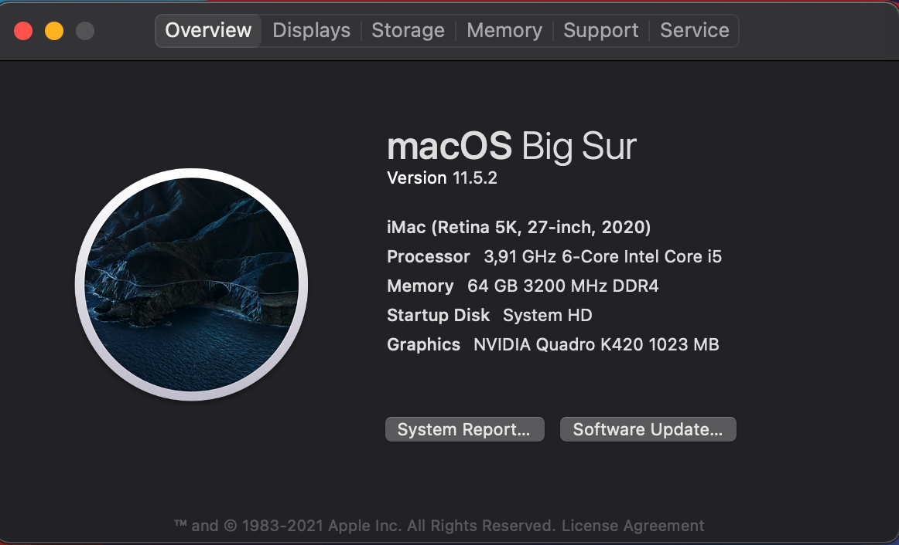
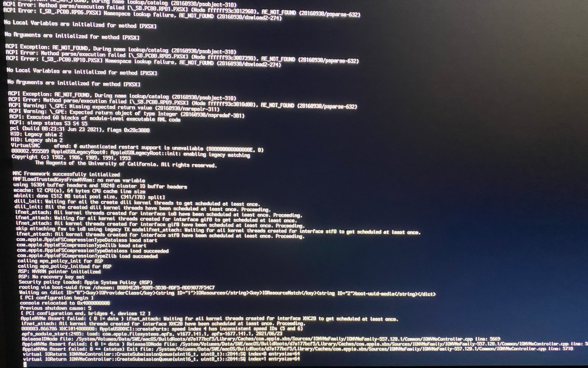
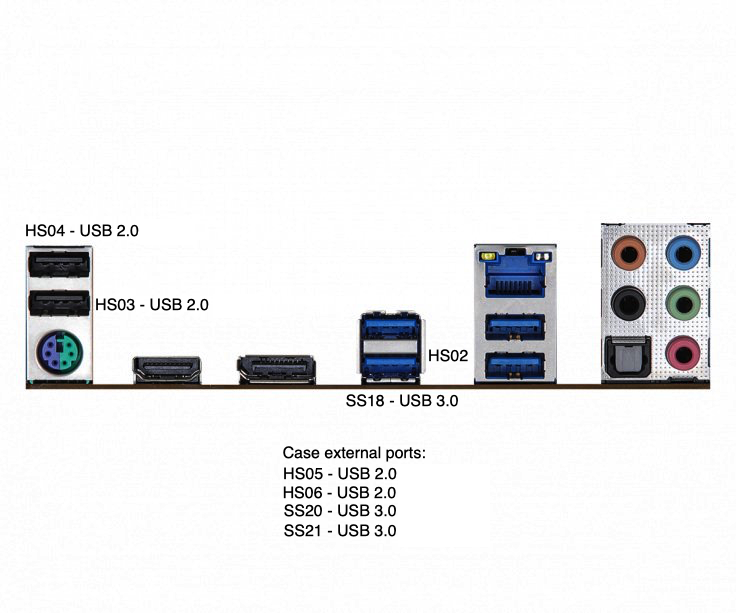
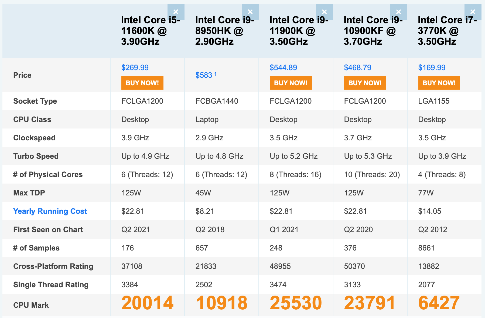

# Hackintosh for i5-11600K Guide with macOS Big Sur 11.5.2

## Info

This is the fully detailed guide on how to create a working Hackintosh machine using:

* macOS Big Sur 11.5.2
* OpenCore 0.7.3
* processor: Intel i5-11600K (11-gen), socket 1200
* motherboard: [ASRock B560M Steel Legend](https://www.asrock.com/MB/Intel/B560M%20Steel%20Legend/index.pl.asp#Specification)
  * LAN: 2.5Gbit Dragon RTL8125BG
  * audio: Realtek ALC897
* RAM: G.Skill Aegis 4x16GB (3200MHz)
* GFX: nVidia Quadro K420 (1GB DDR3)
* SSD: Kioxia 512 GB NVMe SSD, Crucial 1TB SATA SSD

This repository contains also `EFI` folder with all binaries produced meanwhile. The missing pieces might be however serial numbers or other hardware identifiers.

All parts of the PC work great. What is not working here is caused only by lack of proper hardware.

Working:

* macOS Big Sur 11.5.2
* NVMe boot drive
* graphics & 4k display
* Gigabit Ethernet with auto-link negotiation
* HDMI audio
* front headphones audio
* USB 2.0 & USB 3.0 gen. 1

What is *NOT* working:

* Bluetooth
* WiFi card
* camera (not tested if USB-connected one will do the job)

Any compatible additional graphic card should do the job. The one used here was just cheap enough as the prices of AMD Radeon 570X or 580X are crazy these days. Remember that due to the fact that 11th-gen iGPU is not yet supported by macOS natively, it can't be used out-of-the-box.



## Disclaimer

Most of the steps, instructions, information etc. has been taken from following sources:

* [Dortania](https://dortania.github.io/OpenCore-Install-Guide) - general OpenCore configuration, tooling info, SSDTs extraction, USB port mapping
* [Hackintosh i5-11400K on Big Sur 11.2.3](https://www.youtube.com/watch?v=O2uDuXSBudI); with [shared settings for ASRock Steel Legend](https://mybox.naver.com/share/list?shareKey=QuiWYI_wB1GVEsBrB8aNjJoG0PHF_coirdt7tLsck2qqHpqF6mCcykf5iiAaTJp7W6RxJH-PRcpsdT1QDE_sTAU%3D) - taken semi-working config; this was really helpful!
* [Hackintosh i5-11600K video](https://www.youtube.com/watch?v=kc5OnPa_jIE) - another tutorial explaining a lot of stuff and inspiring more configuration tweaks & ideas
* [EASY USB Port Mapping on Intel 2020](https://www.youtube.com/watch?v=uww6Cizil_g) - USB port-mapping approach tutorial; however nothing mentioned here worked straight with current build and had to use [USBMap](https://github.com/corpnewt/USBMap) instead

## Additional hardware

1. [TP-Link TL-WN725N](https://www.tp-link.com/pl/support/download/tl-wn725n/v1/) - WiFi USB dongle
1. USB 3.0 hub (like [SilverMonkey HUB 4x USB 3.0](https://silvermonkey.com/produkt/hub-4x-usb-3-0/))
1. 16GB USB dongle for macOS Big Sur (actually used [Unitek Y-1096](https://www.unitek-products.com/products/usb3-0-to-sata6g-adapter) with an old Corsair ForceLS 120GB SSD)
1. 16GB USB dongle for Ubuntu

## Tools

List of needed tools:

1. [OC Gen-X](https://github.com/Pavo-IM/OC-Gen-X) - initial configuration creator
1. [ProperTree](https://github.com/corpnewt/ProperTree) - .plist editor, however Xcode works great too
1. [MountEFI](https://github.com/corpnewt/MountEFI) - to mount hidden boot partition (on both installer USB-stick & destination machine)
1. [SSDTTime](https://github.com/corpnewt/SSDTTime) - generator of ACPI tables on destination hardware
1. [USBMap](https://github.com/corpnewt/USBMap) - generator of dedicated USB port mapping kernel extension
1. [HackingTool by Headkaze](https://github.com/headkaze/Hackintool) - to verify settings on running macOS are fine; wasn't always working fine if `EFI` configuration had error on target machine

Others:

I also needed:

1. macOS - to download and create bootable USB with macOS Big Sur
1. Windows - to create another dongle with bootable Ubuntu (explained below); macOS could be used as well, it was just easier at that time
1. LiveUSB with Ubuntu - to grab ACPI tables (SSDTs) on destination hardware

## Installation

The whole procedure is extremely easy these days:

1. Update BIOS settings
1. Create a bootable Ubuntu dongle
1. Run Ubuntu LiveUSB without installing anything and read ACPI tables (described below; aka SSDTs) needed to boot macOS
1. Create a bootable macOS dongle
1. Prepare the `EFI` folder, that will be placed onto hidden `EFI` partition of the macOS dongle that will contain patches valid for destination hardware that will emulate missing chips or connections of the PC board (comparing to native macOS board).
1. Install macOS
1. Copy `EFI` folder from USB dongle partition into `EFI` partition on the destination NVMe drive.
1. Login onto macOS
1. Fix USB mapping

## BIOS Setup

Following features have to be properly enabled or disabled to make the macOS bootable:

* enable XMP on memory modules to achieve 3200MHz frequency
* `Advanced > CPU Configuration`:
  * Above 4G Decoding - `Enabled` (as Disabled by default)
  * VT-d - `Disabled` (as Enabled by default)
  * iGPU Multi-Monitor - `Disabled` (as Enabled by default)
  * CFG Lock - `Disabled` (as Enabled by default)
* `Advanced > Storage Configuration`:
  * SATA Mode Selection - set to `AHCI`
  * SATA Aggressive Link Power Management - `Disabled`
* `Advanced > USB Configuration`:
  * Legacy USB Support - `Enabled`
  * XHCI Hand-off - `Enabled` (as Disabled by default)
* `Boot`:
  * Fast Boot - `Disabled` (as Enabled by default)
  * Secure Boot - `Disabled`
* `Boot > CSM (Compatibility Support Mode)`:
  * CSM - Disabled (as Enabled by default)

It's also recommended here to set booting order to look for OS on attached USB drives, then on the internal drive. This can be changed once the whole installation succeeds.

Official info could be found [here](https://dortania.github.io/OpenCore-Install-Guide/config.plist/comet-lake.html#intel-bios-settings).

Visit [this folder](./art/bios) to see BIOS-related configuration images.

## ACPI

Best way to get proper ACPI files (aka .aml) is tu use [SSDTTime](https://github.com/corpnewt/SSDTTime) directly on the target machine and extract them.

Steps to create desired files (in particular for the platform: `SSDT-AWAC.aml`, `SSDT-EC.aml`, `SSDT-PLUG.aml` and `SSDT-USB-Reset.aml`) present as following:

1. Create bootable Ubuntu USB
    * start a Windows machine
    * plug-in 16GB+ USB-stick
    * download [Rufus](https://rufus.ie/)
    * download [Ubuntu Desktop ISO](https://ubuntu.com/download)
    * run Rufus, select USB-stick, select `FreeDOS` boot-selection and point to Ubuntu ISO as described [here](https://ubuntu.com/tutorials/create-a-usb-stick-on-windows#4-boot-selection-and-partition-scheme)
1. Upload [SSDTTime](https://github.com/corpnewt/SSDTTime) tool onto the USB-stick too as it will be required later, full info is described [here](https://dortania.github.io/Getting-Started-With-ACPI/ssdt-methods/ssdt-easy.html#running-ssdttime). For example keep it under `tools/SSDTTime` folder.

Now, we can actually plug the USB-stick and run Ubuntu with **SSDTTime**. Reboot the machine and:

1. Boot `Ubuntu` using `save graphics`. Somehow the nVidia Quadro K420 was not recognized and regular startup will hang (or display black screen) in later stages.

1. Wait until disk is checked (or hit `Ctrl-C` to skip it).

1. Finally - instead of installing Ubuntu, just use `Try Ubuntu` option. It will run the Live version of the system. Simply remember that everything is just kept in memory and you will loose all data once the device gets restarted and since we need some outcomes from SSDTime in a moment - play attention to copy them into the source USB-stick at the end.

1. Copy the `SSDTTime` from USB-stick. Drive should be mounted by default as `/media/ubuntu` into your home folder. Somehow running it from thumb directly was failing for me.

    ```shell
    $ cp -r ~/ /media/ubuntu/tools/SSDTTime
    ```

1. Grant execution privileges to `SSDTTime.py` and `iasl` files.

    ```shell
    $ chmod +x SSDTTime.py
    $ chmod +x Scripts/iasl
    ```

1. Run the `SSDTTime.py` script and follow the instructions on screen.

    ```shell
    $ python3 SDDTTime.py
    ```

  > Since Ubuntu didn't recognized graphics card, nor ethernet it might be useful to enable WiFi via dongle mentioned earlier to get web access. Run the `Settings app`, then navigate to `WiFi` and add your network credentials.

Sequence to create respective SSDT files:

* hit 8 - dump - creates `DSDT.aml`
* hit 4 - plugin type - `SSDT-PLUG.aml`
* hit 5 - PMC - `SSDT-PMC.aml`
* hit 6 - AWAC - `SSDT-AWAC.aml`
* hit 2 - FakeEC - `SSDT-EC.aml`
* hit 1
* hit 7 - Reset USB - `SSDT-USB-Reset.aml`

## EFI folder creation

This partition (and folder with the same name) are used by the BIOS to start the operating system. It's used here to configure the hardware, emulate the missing pieces and prepare it to be correctly recognized as macOS. It consists of 4 main components:

1. OpenCore binaries - a custom bootloader
1. ACPI - current hardware info
1. Kexts - custom macOS kernel extensions to communicate with PC hardware
1. `config.plist` - which brings them all, and in the darkness binds them.

Since I have used [OC Gen-X](https://github.com/Pavo-IM/OC-Gen-X) to create initial configuration based on video tutorials mentioned above, the validation of used components suitable for hardware was done by following strictly recipe from [Dortania guide](https://dortania.github.io/OpenCore-Install-Guide/ktext.html). It has a really detailed info and recommend going through it to be familiar with all components and the way they are used.

Use platform as: `iMacPro1,1`.

OC has been placed under: `/EFI/BOOT/BOOTx64.efi`, `/EFI/OC/OpenCore.efi`, `/EFI/OC/Drivers/HfsPlus.efi`, `/EFI/OC/Drivers/OpenRuntime.efi`.

Compiled ACPI/SSDTs were placed under: `/EFI/OC/ACPI` folder.

Kernel extensions were placed under: `/EFI/OC/Kexts` folder.

> Note: [ProperTree](https://github.com/corpnewt/ProperTree) can be used to edit the `config.plist` and add entries for components above, enable quirks and custom settings.

> Note 2: [MountEFI](https://github.com/corpnewt/MountEFI) can be used to copy create `EFI` folder onto the bootable USB-stick.

## Booting problems

Unfortunately first obstacle after try to boot was the problem with far too many USB ports defined in ACPI tables for ASRock motherboard and without `XhciPortLimit` quirk set to `true` - the whole system was not even starting correctly. It simply hanged just after USB initialization, sometimes after NVMe or Ethernet card initialization.



The second thing I noticed after applying this quirk was the inability to use keyboard and mouse during the installation process. Somehow the USB 2.0 ports I used in BIOS from the back of the motherboard were not working at all. Fix for it was to use the USB 3.0 hub, which I could place inside the case front-panel USB port. These two ports were the only one working for the whole machine.

In the following sections, once the installation is completed, I show how to make all USB 2.0 and USB 3.0 ports to run again.

## Changing CPU ID

Under: `Root > Kernel > Emulate`

add following definition, that will change 11th-gen CPU pretending to be 10th-gen CPU:

| Key | Type | Value |
| --- | --- | --- |
| Cpuid1Data | Data | \<EA060900000000000000000000000000\> |
| Cpuid1Mask | Data | \<FFFFFFFF000000000000000000000000\> |
| DummyPowerManagement | Booelan | 0 |
| MaxKernel | String | |
| MinKernel | String | |

## Kernel Extensions (kext)

### Ethernet

Kext: `LucyRTL8125Ethernet.kext` - works best with 2.5Gbit Dragon `RTL8125BG` onboard chip. In my case it was working fine and auto-negotiating speed once macOS was installed. However I have seen issues in some online tutorials and it might be required to go to `Ethernet` settings, `Advanded > Hardware` and manually set the desired Gigabit speed to `1000baseT`.

### Graphics

Kext: `WhateverGreen.kext`.

No special configuration required.

### Audio

Kexts: `AppleALC.kext`, `AppleALCU.kext`.

Nothing more needs to be setup.

Supported list of codecs can be found [here](https://github.com/acidanthera/AppleALC/wiki/Supported-codecs). However I haven't had to do anything special to make the audio work out-of-the-box once HDMI was plugged-in and connected with monitor containing speakers.

### USB

During installation only! After use a dedicated kext created in "USB mapping" section.

Kext: `USBInjectAll.kext`

### NVMe

Kext: `NVMeFix.kext`.

## USB mapping

What was a strange thing with this setup during the installation was the disappearing support for almost all build-in USB ports. If keyboard and mouse were placed in back ports (described as `HS03` & `HS04`) they got gone immediately when installation started. Trick used here was to use an USB 3.0 hub, which split the signal from the case front-panel USB 3.0 port for both: mouse and keyboard. This way hub was also the only one working for a while during the configuration process, while the second `HS04` port was connected to USB-stick with an installed. However other USB 3.0 ports worked perfectly good.

It could all be fixed later, once installation completed. At this stage the best approach was to:

1. Mount internal `EFI` partition.
1. Run [USBMap](https://github.com/corpnewt/USBMap) with the `XhciPortLimit` set to true as is done now and with `USBInjectAll.kext` available. At this stage USB 3.0 ports should be visible.
1. Place USB 3.0 stick into all available physical ports and name them (`N` key) accordingly (as `SSXX`, what means SuperSpeed) on the board outputs image.
1. Remove `XhciPortLimit` and `USBInjectAll.kext` from `EFI`'s `config.plist` file and reboot the machine.
1. At this stage only USB 2.0 ports should be visible by macOS. Repeat detection of all ports by placing USB 2.0 device (mouse? or USB 2.0 stick) into every physical port and name them accordingly (as `HSXX` -> HighSpeed), similarly as before.



At the end of the process the USBMap tool knowns following info about the ports (which is far less than 15 ports and all USB 2.0 & USB 3.0 work flawlessly):

```plain
#######################################################
#                Discover USB Ports                   #
#######################################################
    ----- XHCI@14 Controller -----
 1. HS02 | AppleUSB20XHCIPort |  2 (02000000) | 14100000 | Type 0
    HS02
    - ASM107x
 2. HS03 | AppleUSB20XHCIPort |  3 (03000000) | 14200000 | Type 0
    HS03
 3. HS04 | AppleUSB20XHCIPort |  4 (04000000) | 14300000 | Type 0
    HS04
 4. HS05 | AppleUSB20XHCIPort |  5 (05000000) | 14400000 | Type 0
    HS05
 5. HS06 | AppleUSB20XHCIPort |  6 (06000000) | 14500000 | Type 0
    HS06
 6. SS02 | AppleUSB30XHCIPort | 18 (12000000) | 14600000 | Type 3
    SS18
    - ASM107x
 7. SS04 | AppleUSB30XHCIPort | 20 (14000000) | 14700000 | Type 3
    SS20
 8. SS05 | AppleUSB30XHCIPort | 21 (15000000) | 14800000 | Type 3
    SS21
```

This configuration can be exported as `USBMap.kext` and replace `USBInjectAll.kext`. Once placed inside the `EFI` folder reboot the machine. After restart all ports should work correctly for USB 2.0 & USB 3.0 devices.

## References

CPU comparison:


